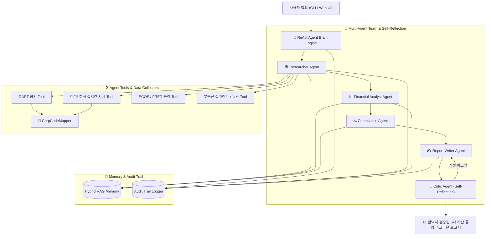

# 🤖 자율형 글로벌 멀티자산 금융 AI Agent 시스템 v1.0 (Advanced Edition)

국내외 5대 금융 자산군(**한국 주식·미국 주식·부동산 실거래가·국고채/미국채 금리·월가 금융 뉴스**)의 공시, 실시간 시세, 법·규제 변화를 자율적으로 탐색하고 팩트체크하여 전문 인사이트 보고서를 생성하는 **차세대 자율형 금융 AI Agent Framework**입니다.

---

## 💡 비전공자도 10초 만에 이해하는 AI 에이전트 동작 원리

이 시스템은 마치 **"금융 종합 연구소의 5인 전문 드림팀"**이 협업하여 보고서를 만드는 것과 똑같이 작동합니다:

```
[사용자의 질문] ➔ "삼성전자 주가랑 강남 아파트 실거래가, 국고채 금리 분석해줘!"
       │
       ▼
1. 🕵️ 자료 조사관 (리서처)     : DART 공시, 실시간 주가, 부동산 실거래가, 금리 데이터를 빛의 속도로 모아옴
2. 📊 수치 분석관 (애널리스트)   : "금리가 오르면 주가와 아파트 대출에 어떤 영향을 주는지" 연관관계를 분석함
3. ⚖️ 팩트 검증관 (컴플라이언스) : AI가 거짓말(환각)을 하지 못하도록 수집된 원본 수치와 100% 대조·팩트체크함
4. ✍️ 보고서 작성관 (라이터)    : 한눈에 보기 편하도록 표와 지표가 담긴 마크다운 리포트를 작성함
5. 🧐 수석 검수관 (크리틱)      : 보고서를 읽어보고 부족하면 스스로 다시 고쳐 쓰게 한 뒤(Self-Correction) 완벽할 때 제출!
```

---

## 🌟 핵심 기능 및 아키텍처 특징

1. **🧠 ReAct 자율 추론 엔진 (Agent Brain)**
   - 정해진 순서대로 작동하는 단순 프로그램이 아닌, 목표가 주어지면 **`생각(Think) ➔ 행동(Act) ➔ 관찰(Observe)`** 루프를 스스로 실행하는 자율형 대뇌 엔진 탑재.
2. **🌐 5대 금융 자산 통합 수집 및 도구 레지스트리 (Tool Registry)**
   - **한국 주식**: DART 공시, 실시간 주가 시세, 주요 재무 비율(PER/PBR/시가총액)
   - **미국 주식**: 나스닥(^IXIC), S&P 500(^GSPC), SOX 지수, NVDA, AAPL, TSLA 실시간 시세 및 Wall Street News RSS
   - **부동산**: 국토교통부 아파트 매매 실거래가, 동별 평당 평균가
   - **채권/금리**: 한국 국고채(3년/10년), 미 국채 10년물(FRED DGS10), 회사채 신용 스프레드
3. **🏢 기업명 ↔ 고유코드 자동 매핑 (`CorpCodeMapper`)**
   - 복잡한 8자리 DART 고유코드(`00126380`)나 6자리 주식 종목코드(`005930`)를 외울 필요 없이, `"삼성전자"`, `"엔비디아"`, `"카카오"` 등의 한글 기업명만 대면 자동으로 코드를 찾아서 조회.
4. **👥 5인 Multi-Agent 드림팀 & 자기 반성(Self-Reflection) 루프**
   - 최종 보고서 작성 전 비판가 에이전트(Critic)가 검토 후 부실할 경우 스스로 고쳐 쓰는 **Self-Correction** 수행.
5. **💡 Cross-Asset 파급 효과 연계 분석 (Global Correlation)**
   - `미 국채 금리 ➔ 주식 시장 할인율(PER Multiplier) ➔ 주택담보대출 금리 부담 ➔ 미 기술주/SOX 지수 ➔ 국내 기술주 수급`의 연결고리를 다차원 분석.
6. **💻 모던 다크모드 웹 대시보드 UI (FastAPI + Vanilla JS)**
   - CLI 환경뿐만 아니라 **FastAPI 백엔드 + 눈이 편안한 SaaS 대시보드 UI** 지원 (`http://localhost:8000`).

---

## 🏗️ 아키텍처 및 에이전트 워크플로우 (Architecture Workflow)



---

## 🔄 에이전트 처리 단계별 핵심 역할

| 단계 | 에이전트 이름 | 비전공자를 위한 핵심 역할 설명 |
| :---: | :--- | :--- |
| **1단계** | **🕵️ 자료 조사관 (Researcher)** | DART 공시, 실시간 주가, 부동산 실거래가, 국채 금리 등 필요한 원천 데이터를 직접 수집함 |
| **2단계** | **📊 수치 분석관 (Analyst)** | 금리 변동이 주식과 부동산 대출에 미치는 파급 효과(Cross-Asset)를 정량 계산함 |
| **3단계** | **⚖️ 팩트 검증관 (Compliance)** | 수집된 숫자와 공시 원문을 대조하여 AI의 거짓말(환각 현상)을 100% 차단 및 검증함 |
| **4단계** | **✍️ 보고서 작성관 (Writer)** | 검증된 결과를 바탕으로 읽기 쉬운 깔끔한 마크다운 분석 보고서를 작성함 |
| **5단계** | **🧐 수석 검수관 (Critic)** | 작성된 보고서를 다각도로 검토하고, 품질이 미흡하면 고쳐 쓰게 만든 뒤 승인함 |

---

## 📂 폴더 구조

```
financial-ai-agent/
├── config/                  # 전역 설정 및 .env 로드
├── src/
│   ├── agent/               # ReAct 자율 추론 대뇌 엔진 (core.py, state.py, prompts.py)
│   ├── agent_tools/         # 8대 Agent Tools (dart, ecos, fred, news, law, stock, us_stock, real_estate, bond)
│   ├── multi_agent/         # 5인 Multi-Agent 팀 및 자기 반성 (roles.py, team.py)
│   ├── memory/              # BM25 + Vector 하이브리드 RAG 기억 장치 (vector_store.py)
│   ├── collectors/          # 원천 수집기 (us_stock, us_news, bond, real_estate, corp_code_mapper)
│   ├── storage/             # DB 및 감사 이력 기록기 (audit_trail.py, models.py)
│   ├── preprocessing/       # 전처리 모듈 (normalizer, tagger, deduplicator)
│   └── reports/             # 리포트 생성기 및 이메일 발송
├── static/                  # SaaS 웹 대시보드 UI (index.html, style.css, app.js)
├── app.py                   # FastAPI 웹 API 서버 진입점
├── main.py                  # CLI 실행 진입점
├── tests/                   # 246개 전체 단위 테스트 모음
└── README.md                # 프로젝트 안내 문서
```

---

## 💻 사용 방법

### 1. 웹 대시보드 UI 실행 (권장)

```bash
# FastAPI 웹 서버 가동
python app.py
```
서버 가동 후 웹 브라우저에서 **`http://localhost:8000`** 접속.

---

### 2. CLI 실행

```bash
# 기본 질의 실행
python main.py "삼성전자 최근 주가 시세와 DART 공시 동향 분석해줘"

# 미국 주식 & 월가 뉴스 질의 실행
python main.py "엔비디아 실시간 주가 시세 및 미국 금융 뉴스 분석해줘"

# Cross-Asset 글로벌 종합 질의 실행
python main.py "한국 국고채 금리와 미국채 금리가 부동산 대출과 주식 시장에 미친 영향을 분석해줘"
```

---

### 3. 전체 단위 테스트 실행

```bash
venv\Scripts\pytest.exe
```
**(전체 246개 단위 테스트가 100% 깔끔하게 통과됩니다.)**

---

## ⚖️ 법적 및 윤리적 원칙 (Disclaimers)

1. **투자 자문 불가**: 본 AI Agent가 생성한 보고서 및 분석 결과는 정량 데이터 및 공시 정리 목적이며, **투자 권유나 금융 자문이 아닙니다.**
2. **팩트 검증**: 수집 원문과의 대조 및 비판가 에이전트의 정밀 검증을 거쳐 환각(Hallucination)을 최소화합니다.

---

## 📜 라이선스

[MIT License](LICENSE)
