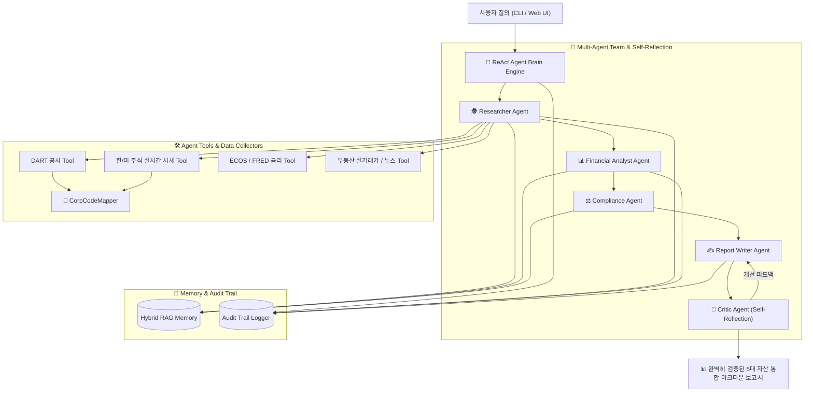
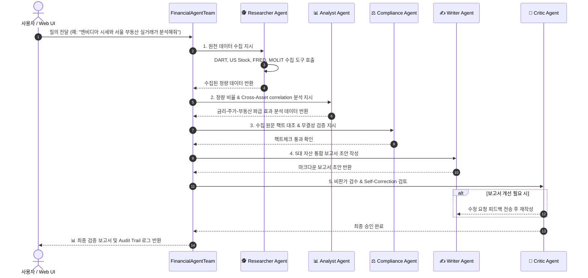

# 🤖 자율형 글로벌 멀티자산 금융 AI Agent 시스템 v1.0 (Advanced Edition)

국내외 5대 금융 자산군(**한국 주식·미국 주식·부동산 실거래가·국고채/미국채 금리·월가 금융 뉴스**)의 공시, 실시간 시세, 법·규제 변화를 자율적으로 탐색하고 팩트체크하여 전문 인사이트 보고서를 생성하는 **차세대 자율형 금융 AI Agent Framework**입니다.

---

## 🌟 핵심 기능 및 아키텍처 특징

1. **🧠 ReAct 자율 추론 엔진 (Agent Brain)**
   - 정해진 순서대로 작동하는 단순 파이프라인이 아닌, 목표가 주어지면 **`생각(Think) ➔ 행동(Act) ➔ 관찰(Observe)`** 루프를 스스로 실행하는 자율형 대뇌 엔진 탑재.
2. **🌐 5대 금융 자산 통합 수집 및 도구 레지스트리 (Tool Registry)**
   - **한국 주식**: DART 공시, 실시간 주가 시세, 주요 재무 비율(PER/PBR/시가총액)
   - **미국 주식**: 나스닥(^IXIC), S&P 500(^GSPC), SOX 지수, NVDA, AAPL, TSLA 실시간 시세 및 Wall Street News RSS
   - **부동산**: 국토교통부 아파트 매매 실거래가, 동별 평당 평균가
   - **채권/금리**: 한국 국고채(3년/10년), 미 국채 10년물(FRED DGS10), 회사채 신용 스프레드
3. **🏢 기업명 ↔ 고유코드 자동 매핑 (`CorpCodeMapper`)**
   - 복잡한 8자리 DART 고유코드(`00126380`)나 6자리 주식 종목코드(`005930`)를 외울 필요 없이, `"삼성전자"`, `"엔비디아"`, `"카카오"` 등의 한글 기업명만 대면 자동으로 코드를 찾아서 조회.
4. **👥 5인 Multi-Agent 드림팀 & 자기 반성(Self-Reflection) 루프**
   - **리서처(Researcher)** ➔ **분석가(Analyst)** ➔ **팩트체커(Compliance)** ➔ **리포터(Writer)** ➔ **비판가(Critic)**
   - 최종 보고서 작성 전 비판가 에이전트(Critic)가 검토 후 부실할 경우 스스로 고쳐 쓰는 **Self-Correction** 수행.
5. **💡 Cross-Asset 파급 효과 연계 분석 (Global Correlation)**
   - `미 국채 금리 ➔ 주식 시장 할인율(PER Multiplier) ➔ 주택담보대출 금리 부담 ➔ 미 기술주/SOX 지수 ➔ 국내 기술주 수급`의 연결고리를 다차원 분석.
6. **💻 모던 다크모드 웹 대시보드 UI (FastAPI + Vanilla JS)**
   - CLI 환경뿐만 아니라 **FastAPI 백엔드 + 눈이 편안한 SaaS 대시보드 UI** 지원 (`http://localhost:8000`).

---

## 🏗️ 아키텍처 및 에이전트 워크플로우 (Architecture Workflow)



---

## 🔄 에이전트 상세 실행 처리 순서 (Step-by-Step Flow)



---

## 📂 폴더 구조

```
financial-ai-agent/
├── config/                  # 전역 설정 및 .env 로드
├── src/
│   ├── agent/               # ReAct 자율 추론 대뇌 엔진 (core.py, state.py, prompts.py)
│   ├── agent_tools/         # 8대 Agent Tools (dart, ecos, fred, news, law, stock, us_stock, real_estate, bond)
│   ├── multi_agent/         # 5인 Multi-Agent 팀 및 자기 반성 (roles.py, team.py)
│   ├── memory/              # BM25 + Vector 하이브리드 RAG 기억 장치 (vector_store.py)
│   ├── collectors/          # 원천 수집기 (us_stock, us_news, bond, real_estate, corp_code_mapper)
│   ├── storage/             # DB 및 감사 이력 기록기 (audit_trail.py, models.py)
│   ├── preprocessing/       # 전처리 모듈 (normalizer, tagger, deduplicator)
│   └── reports/             # 리포트 생성기 및 이메일 발송
├── static/                  # SaaS 웹 대시보드 UI (index.html, style.css, app.js)
├── app.py                   # FastAPI 웹 API 서버 진입점
├── main.py                  # CLI 실행 진입점
├── tests/                   # 246개 전체 단위 테스트 모음
└── README.md                # 프로젝트 안내 문서
```

---

## 💻 사용 방법

### 1. 웹 대시보드 UI 실행 (권장)

```bash
# FastAPI 웹 서버 가동
python app.py
```
서버 가동 후 웹 브라우저에서 **`http://localhost:8000`** 접속.

---

### 2. CLI 실행

```bash
# 기본 질의 실행
python main.py "삼성전자 최근 주가 시세와 DART 공시 동향 분석해줘"

# 미국 주식 & 월가 뉴스 질의 실행
python main.py "엔비디아 실시간 주가 시세 및 미국 금융 뉴스 분석해줘"

# Cross-Asset 글로벌 종합 질의 실행
python main.py "한국 국고채 금리와 미국채 금리가 부동산 대출과 주식 시장에 미친 영향을 분석해줘"
```

---

### 3. 전체 단위 테스트 실행

```bash
venv\Scripts\pytest.exe
```
**(전체 246개 단위 테스트가 100% 깔끔하게 통과됩니다.)**

---

## ⚖️ 법적 및 윤리적 원칙 (Disclaimers)

1. **투자 자문 불가**: 본 AI Agent가 생성한 보고서 및 분석 결과는 정량 데이터 및 공시 정리 목적이며, **투자 권유나 금융 자문이 아닙니다.**
2. **팩트 검증**: 수집 원문과의 대조 및 비판가 에이전트의 정밀 검증을 거쳐 환각(Hallucination)을 최소화합니다.

---

## 📜 라이선스

[MIT License](LICENSE)
