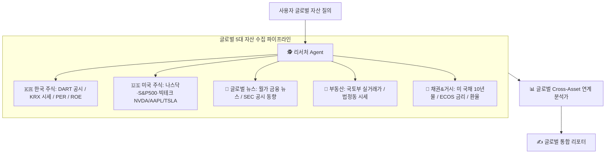

# 🌐 Global Multi-Asset (한/미 주식 + 부동산 + 채권 + 글로벌 뉴스) 통합 자산 분석 고도화 계획서

> **작성자**: 글로벌 자산운용 수석 전략가 & AI Agent 시스템 아키텍트  
> **목적**: 국내 중심 분석을 넘어 **미국 주식(나스닥/S&P500/빅테크), SEC 공시, 월가 금융 뉴스, 국내 부동산, 채권, 거시경제 지표가 융합된 글로벌 멀티자산 분석 에이전트**로 고도화

---

## 🏛️ 1. 글로벌 멀티 자산군 아키텍처 (Global Multi-Asset Architecture)

---

## 🎯 2. 자산군별 수집 및 분석 지표 (글로벌 확장)

### ① 🇺🇸 미국 주식 & 증시 지수 (US Equities & Indices)
- **주요 지수**: 나스닥(NASDAQ), S&P 500, 필라델피아 반도체 지수(SOX)
- **빅테크 및 주요 종목**: 엔비디아(NVDA), 애플(AAPL), 마이크로소프트(MSFT), 테슬라(TSLA) 등
- **수집 항목**: 실시간 미국 주가, 시가총액, PER, PBR, 52주 최고/최저가

### ② 📰 글로벌 금융 뉴스 & 공시 (US Financial News & SEC)
- 월가(Wall Street) 주요 이슈, 미 연준(Fed) FOMC 금리 발표 동향
- SEC EDGAR 대형주 공시 및 글로벌 반도체/IT 테크 뉴스 RSS 피드 수집

### ③ 🇰🇷 한국 주식 (KR Equities)
- DART 공시 목록 및 클릭 링크
- 실시간 현재 주가, 시가총액, PER, PBR, ROE, FCF(자유현금흐름)
- Piotroski F-Score (재무 건전성 9점)

### ④ 🏢 부동산 (Real Estate)
- 국토교통부 아파트/상업용 건물 실거래가 (매매/전세 수치) 및 시세 추이
- 미 국채/한국 기준금리 변동에 따른 부동산 대출금리 영향 분석

### ⑤ 📜 채권, 금리 및 환율 (Bonds, Rates & FX)
- 미 국채 10년물 금리 (FRED 연동) 및 한국 3년/10년 국고채 금리
- 원/달러 환율(KRW/USD), WTI 국제 유가 및 신용 스프레드

---

## 🔄 3. 글로벌 Cross-Asset 상관관계 연계 분석 (핵심 파급 효과)

1. **미국 증시 ➔ 한국 증시 파급효과**:
   - 엔비디아(NVDA) 및 필라델피아 반도체 지수(SOX) 변동 ➔ 삼성전자 & SK하이닉스 주가 영향 자동 분석.
2. **미 연준(Fed) 금리 & 미 국채 ➔ 환율 & 한국 자산 파급효과**:
   - 미 국채 10년물 금리 상승 ➔ 원/달러 환율 상승 ➔ 국내 외국인 수급 변동 및 대출 금리 파급효과 분석.

---

## 🚀 4. 단계별 실행 로드맵 (Step-by-Step)

- **[1단계] 미국 주식 & 글로벌 뉴스 수집 도구 구축 (`USStockCollector` & `GlobalNewsCollector`)**:
  - 미국 Ticker(NVDA, AAPL, TSLA, ^IXIC) 시세 수집기 및 글로벌 뉴스를 에이전트 도구함에 추가.
- **[2단계] 국내외 5대 멀티자산 수집 파이프라인 융합**:
  - 리서처 에이전트가 미국 주식, 한국 주식, DART, 부동산, 채권, 환율을 동시에 가동하는 자동 판단 로직 연동.
- **[3단계] 글로벌 5대 자산 통합 보고서 템플릿 개편**:
  - **"1. 🇺🇸 미국 증시 & 빅테크 시세"**, **"2. 🇰🇷 국내 주가 & DART 공시"**, **"3. 🏢 부동산 & 📜 채권/금리"**, **"4. 💡 글로벌 Cross-Asset 인사이트"** 4대 섹션 표기.
- **[4단계] 웹 대시보드 UI 예시 칩 추가 및 100% 단위 테스트 검증**.
